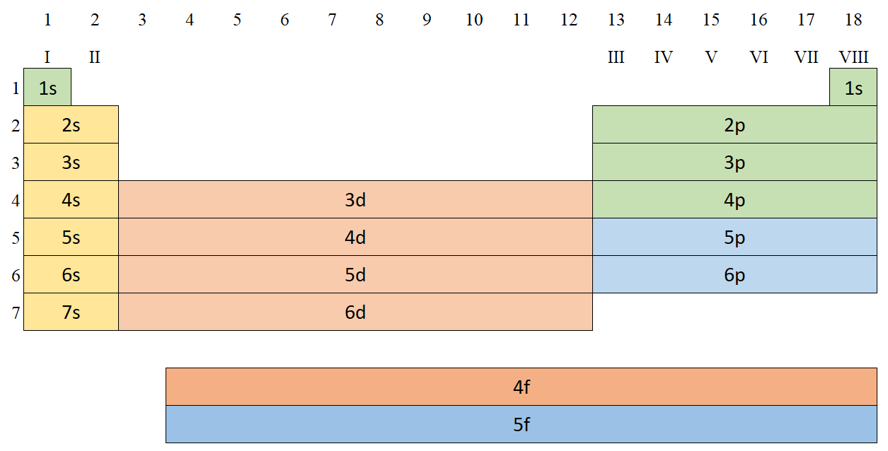
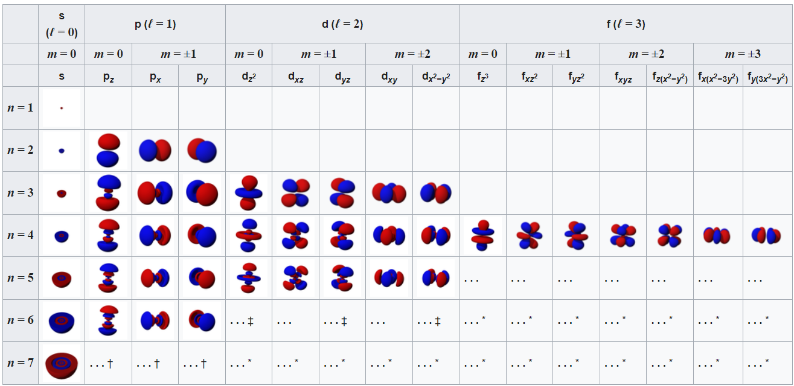
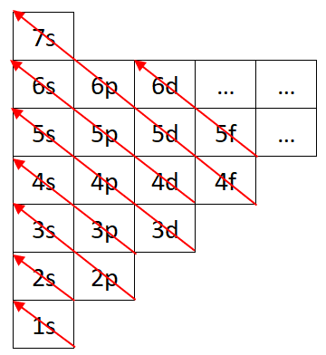

# Kvanttimekaaninen atomimalli

Bohrin atomimallin jälkeen Werner Heisenberg, Erwin Schrödinger, Max Born sekä Nils Bohr jatkoivat uuden atomimallin kehittämistä, joka selittäisi siirtymämetallien elektronikonfiguraation. Kvanttimekaaninen atomimalli on edelleen käytössä oleva malli. Se perustuu kvanttiteoriaa, jonka mukaan ainetta koostavia hiukkasia (kuten elektronien), voidaan mallintaa aaltoina. Elektroneilla on tietty liike-energia, joka ilmenee aaltomuodossa. Kvanttiluvut tulivat käyttöön 1920-luvulla, kun kvanttiteoria alkoi saada muotoaan.

Ajasta riippumaton Schrödingerin aaltoyhtälö yhdelle elektronille kolmessa ulottuvuudessa

$ \left(-\frac{\hbar^2}{2m}\nabla^2 + V(x,y,z)\right)\psi(x,y,z) = E\psi(x,y,z) $, jossa

$\psi(x,y,z)$ on aaltofunktio, $V(x,y,z)$ potentiaalifunktio, $m$ elektronin massa, $\hbar$ Planckin vakio ja $E$ energia. $\nabla^2$ on Laplacen operaattori kolmessa ulottuvuudessa, joka voidaan ilmaista seuraavasti:

$ \nabla^2 = \frac{\partial^2}{\partial x^2} + \frac{\partial^2}{\partial y^2} + \frac{\partial^2}{\partial z^2} $

Kvanttimekaanisessa atomimallissa elektronit sijatsevat ns. **orbitaaleilla**. Elektronit eivät siis liiku tiettyä rataa pitkin, kuten Bohrin atomimallissa, sillä niiden tarkkaa sijaintia ei voida ennustaa. {index}`Orbitaali` kuvaakin matemaattista todennäköisyysaluetta, jossa tietyllä energiatasolla oleva elektroni sijaitsee. Jokainen Bohrin atomimallia vastaava elektronikuori jaetaan useisiin energiatasoihin eli $s, p, d \ \text{ja} \ f$ -orbitaaleihin. Ensimmäinen K-kuori vastaa yhtä 1s-orbitaalia ja toinen L-kuori vastaa yhtä 2s- ja kolmea 2p-orbitaalia. Tätä korkeammat energiatasot (elektronikuoret M, N jne.) voivat jakautua useisiin energiatasoihin, joissa on s-orbitaalin ja kolmen p-orbitaalin lisäksi viisi d-orbitaalia ja seitsemän f-orbitaalia.

```{figure-md} Orbitaalit jaksollisessa järjestelmässä


Atomien orbitaalit jaksollisessa järjestelmässä
```

```{figure-md} Orbitaalit


Atomien orbitaalien muotoja eri kvanttilukuyhdistelmillä. lähde: <a href="https://en.wikipedia.org/wiki/Atomic_orbital" target="_blank">Wikipedia</a>
```

## Elektronien täyttyminen orbitaaleille
- Minimienergiaperiaatteen mukaan elektronit täyttyvät kaikken matalaenergisimmille orbitaaleille.
- Yhdelle orbitaalille mahtuu enintään kaksi elektronia.
- **{index}`Hundin sääntö`**: elektronit täyttyvät orbitaaleille yhdellä elektronilla samansuuntaisin spinein (spin-kvanttiluku) mahdollisimman pitkään.
- **{index}`Paulin kieltosääntö`**: samassa kvanttitilassa ei voi olla kuin yksi elektroni. Täten samalla orbitaalilla olevilla elektroneilla on vastakkaiset spin-kvanttiluvut.

:::{admonition} Esimerkki: litiumatomin elektronikonfiguraatio
:class: tip
Jaksollisen järjestelmän perusteella litiumin järjestysluku on 3, joten litiumilla on kolme elektronia.
1. Ensimmäinen elektroni menee 1s-orbitaalille (minimienergiaperiaate).
2. 1s-orbitaalille mahtuu vain kaksi elektronia, joten toisella elektronilla pitää olla vastakkainen spini (Paulin kieltosääntö).
3. Kolmas elektroni menee seuraavaksi matalimmalle orbitaalille eli 2s-orbitaalille.

Litiumin elektronikonfiguraatio on täten $1s^22s$.
:::

Elektronien täyttyminen orbitaaleille voidaan käytännössä tiiviistää seuraavaan kuvaan.
```{figure-md} Elektronien täyttyminen orbitaaleille


Elektronien täyttyminen orbitaaleille
```

## Kvanttiluvut
Kvanttimekaanisessa atomimallissa käytetään neljää kvanttilukua, jotka kertovat elektronin sijainnista ja energiatilasta atomissa. Nämä kvanttiluvut ovat pääkvanttiluku (n), sivukvanttiluku (l), magneettinen kvanttiluku (m) ja spin-kvanttiluku (s).
- Pääkvanttiluku $(n = 1, 2, 3, 4, \dots)$ kertoo elektronin etäisyyden ytimeen. Mitä suurempi pääkvanttiluku on, sitä kauempana elektroni on ytimen keskipisteestä ja sitä suurempi sen energia on. Pääkvanttiluvut vastaavat Bohrin atomimallin elektronikuoria $K, L, M, N \cdots $.
- Sivukvanttiluku $(l = 0, \dots , n-1)$ määrää elektronin liikemäärän suunnan. Se kertoo myös, kuinka monta erilaista muotoa orbitaalilla voi olla. Sivukvanttiluvun arvoja vastaavat orbitaalit $s, p, d \ \text{ja} \ f$ vastaavasti.
- Magneettinen kvanttiluku $(m= 0, \pm 1, \dots , \pm l)$ kertoo elektronin liikemäärän suunnan avaruudessa.
- Spin-kvanttiluku $(s=\pm \frac{1}{2})$ kertoo elektronin pyörimisliikkeestä oman akseliansa ympäri. Elektronit voivat pyöriä joko "ylös-" tai "alaspäin", joten spin-kvanttiluku on aina $\frac{1}{2}$ tai $-\frac{1}{2}$.

:::{admonition} Esimerkki: litiumatomin elektronikonfiguraatio kvanttiluvuilla
:class: tip
Jaksollisen järjestelmän perusteella litiumin järjestysluku on 3. Koska ensimmäiselle L-kuorelle mahtuu vain 2 elektronia, on kolmas elektroni toisella kuorella, joten $n = 2$.
- K-kuoren elektronien kvanttiluvut ovat $n = 1, l = 0, m = 0, s=\pm \frac{1}{2}$.
- L-kuorella olevan yksittäisen elektronin kvanttiluvut ovat mahdollisimmat pienet eli $n = 2, l = 0, m = 0, s=\frac{1}{2}$.
:::

:::{admonition} Esimerkki: täynnä olevan toisen elektronikuoren elektronien kvanttiluvut
:class: tip
Toisella elektronikuorella eli L-kuorella voi olla seuraavia kvanttilukuyhdistelmiä, kun $n = 2$:
- $l = 0 \ \text{tai} \ 1 $
- $m = 0 \ \text{tai} \ \pm 1$
- Lisäksi jokaisella orbitaalilla voi olla enintään kaksi elektronia eri spin-kvanttiluvulla, joten kaikki mahdolliset elektronit ovat

| elektroni nro | kvanttilukuyhdistelmä              | Vastaava orbitaali |
| ------------- | ---------------------------------- | ------------------ |
| 1             | $n=2, l=0, m = 0, s=\frac{1}{2}$   | 2s                 |
| 2             | $n=2, l=0, m = 0, s=-\frac{1}{2}$  | 2s                 |
| 3             | $n=2, l=1, m = 0, s=\frac{1}{2}$   | 2p<sub>x</sub>     |
| 4             | $n=2, l=1, m = 0, s=-\frac{1}{2}$  | 2p<sub>x</sub>     |
| 5             | $n=2, l=1, m = 1, s=\frac{1}{2}$   | 2p<sub>y</sub>     |
| 6             | $n=2, l=1, m = 1, s=-\frac{1}{2}$  | 2p<sub>y</sub>     |
| 7             | $n=2, l=1, m = -1, s=\frac{1}{2}$  | 2p<sub>z</sub>     |
| 8             | $n=2, l=1, m = -1, s=-\frac{1}{2}$ | 2p<sub>z</sub>     |
:::

Eli toiselle kuorelle mahtuu enintään 8 elektronia $(2n^2=2 \cdot 2^2=8)$.